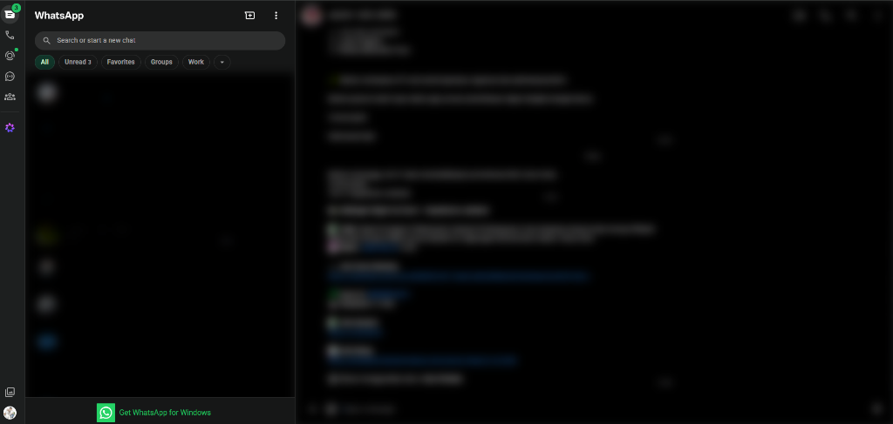
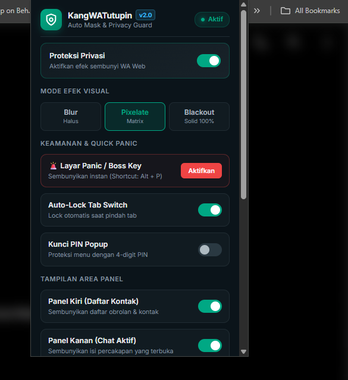

# 🙈 KangWATutupin - WhatsApp Web Privacy & Security Guard

<p align="center">
  
</p>

<p align="center">
  <b>Ekstensi Google Chrome Open-Source untuk melindungi privasi WhatsApp Web dari intipan orang di sekitar Anda.</b>
</p>

<p align="center">
  
  
  
  
</p>

---

## 📸 Preview Tampilan

<p align="center">
  
  <br>
  <em>Tampilan WhatsApp Web dengan Masking / Blur Aktif (Otomatis Tertutup)</em>
</p>

<p align="center">
  
  <br>
  <em>Menu Kontrol Popup KangWATutupin (Dark Emerald Theme & Pilihan Efek)</em>
</p>

---

## 🌟 Fitur Utama

- **🛡️ Auto-Mask & Blur Panel**: Menyembunyikan daftar chat (panel kiri), pesan aktif (panel kanan), foto profil, media (foto, video, stiker), dan pratinjau pesan secara default.
- **👁️ Hover Reveal**: Arahkan kursor mouse ke area tertentu untuk melihat isi percakapan secara mulus dan instan.
- **🚨 Panic Button / Boss Key (`Alt + P` / Double `Esc`)**: Munculkan layar penutup *Layar Terkunci* dalam sekejap saat ada orang mendekat.
- **🎨 3 Pilihan Efek Visual**:
  - **Blur**: Gaussian blur halus standar.
  - **Pixelate**: Efek kotak piksel matrix retro.
  - **Blackout**: Penutup warna solid 100% tanpa bayangan teks.
- **🔐 PIN Lock Protection**: Kunci menu popup ekstensi dengan 4-digit PIN agar pengaturan tidak bisa diubah sembarangan oleh orang lain.
- **🔒 Auto-Lock on Tab Switch**: Otomatis mengunci dan menyembunyikan tampilan saat Anda berpindah ke tab atau aplikasi lain.
- **⏱️ Hover Delay Slider (0ms – 1000ms)**: Mengatur delay waktu sebelum pesan terbuka saat mouse diarahkan, mencegah pesan terbuka saat kursor melintas tidak sengaja.

---

## 📥 Cara Instalasi (Mudah & Cepat)

Anda dapat memilih salah satu metode instalasi di bawah ini:

### ⚡ Cara 1: Menggunakan File `.crx` (Drag & Drop)
1. Unduh file **[KangWATutupin-v2.0.0.crx](https://github.com/bapakstack/KangWATutupin/releases/latest)**.
2. Buka browser **Google Chrome** dan buka halaman `chrome://extensions/`.
3. Aktifkan toggle **Developer mode** (Mode Pengembang) di pojok kanan atas.
4. **Drag & drop (seret dan lepaskan)** file `KangWATutupin-v2.0.0.crx` langsung ke dalam halaman ekstensi Chrome.
5. Klik **Add extension**. Selesai! 🎉

---

### 📦 Cara 2: Menggunakan File `.zip` (Folder Ekstrak)
1. Unduh **[KangWATutupin-v2.0.0.zip](https://github.com/bapakstack/KangWATutupin/releases/latest)** dan ekstrak file zip-nya.
2. Buka `chrome://extensions/` di Google Chrome lalu aktifkan **Developer mode**.
3. Klik tombol **Load unpacked** (Muat yang tidak dikemas) di kiri atas.
4. Pilih folder hasil ekstrak tadi. Selesai! 🎉

---

## ⌨️ Pintasan Keyboard (Shortcuts)

| Shortcut | Fungsi |
| :--- | :--- |
| **`Alt + P`** | Mengaktifkan / Menonaktifkan Panic Screen instan |
| **`Esc` (tekan 2x)** | Alternatif cepat untuk memicu Panic Screen |

---

## 🛠️ Struktur Project

```
KangWATutupin/
├── manifest.json       # Konfigurasi Manifest V3
├── popup/
│   ├── popup.html      # UI Pengaturan Popup
│   ├── popup.css       # Styling Dark Emerald
│   └── popup.js        # Handler State, PIN & Event Listener
├── content/
│   ├── content.css     # Filter CSS Blur, Pixelate & Blackout
│   └── content.js      # Integrasi DOM & Keyboard Listener
└── icons/              # Aset Ikon (16x16, 48x48, 128x128)
```

---

## 🤝 Kontribusi & Dukungan

Proyek ini bersifat **Open-Source**. Jika Anda memiliki ide fitur baru, perbaikan bug, atau ingin berkontribusi:

1. **Fork** repositori ini
2. Buat branch fitur baru (`git checkout -b feature/FiturKeren`)
3. Commit perubahan (`git commit -m 'feat: Tambah Fitur Keren'`)
4. Push ke branch (`git push origin feature/FiturKeren`)
5. Buat **Pull Request**

---

## 📄 Lisensi

Didistribusikan di bawah Lisensi MIT. Lihat file `LICENSE` untuk informasi lebih lanjut.

Dibuat dengan ❤️ oleh [@bapakstack](https://github.com/bapakstack).
